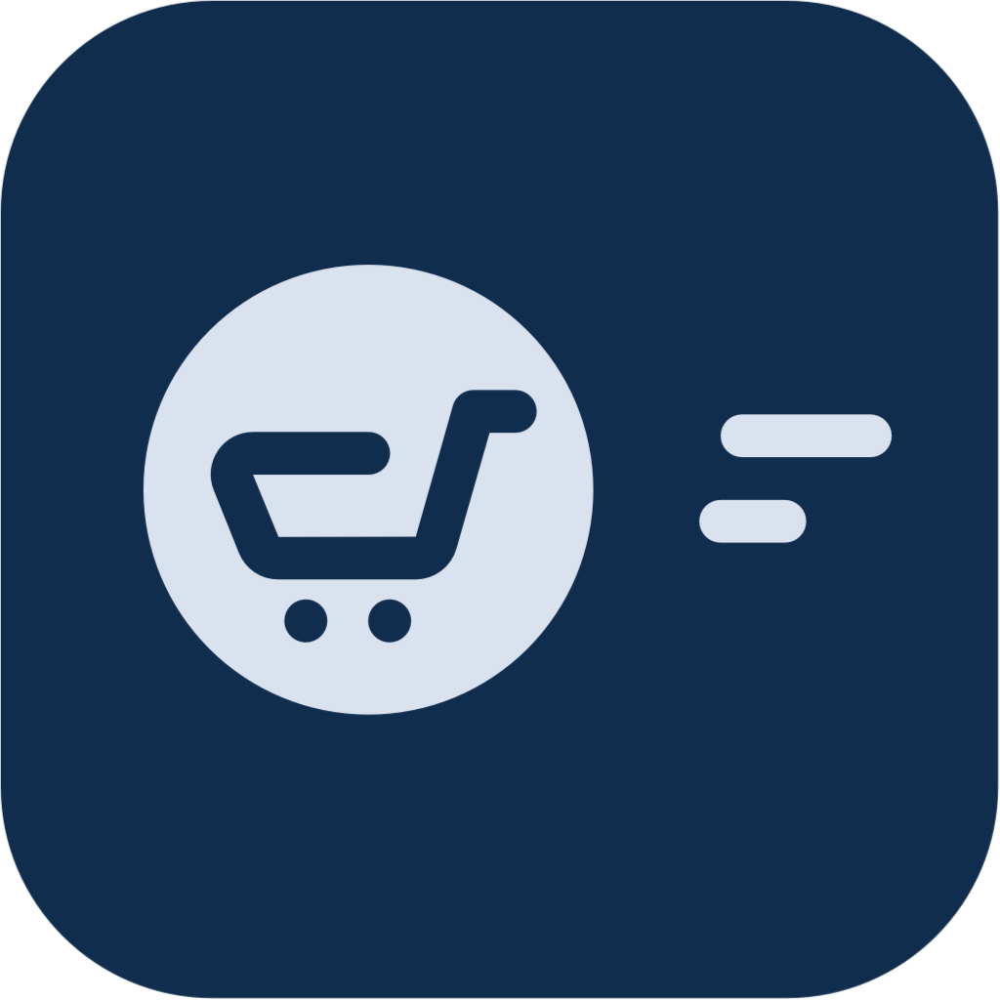

# Due Kasir — Open Source POS App

[](https://flutter.dev)
[](LICENSE)
[](https://flutter.dev/multi-platform)
[](pubspec.yaml)

**Due Kasir** is a free and open-source Point of Sale (POS) application built with Flutter. It focuses on an **offline-first** experience, making it reliable even without an internet connection. Perfect for small businesses, shops, and warungs.

[](https://play.google.com/store/apps/details?id=com.devindo.due_kasir)

---

## 📸 Screenshots

> _Screenshots and demo videos coming soon._

---

## ✨ Features

### 🏪 Inventory Management
- [x] Add, edit, and delete items
- [x] Search items instantly
- [x] Export & import inventory via CSV
- [x] Scan barcodes using an external device (USB/Bluetooth)
- [x] Scan barcodes using your mobile phone camera

### 💳 Selling / Cashier
- [x] Fast item lookup at checkout
- [x] Barcode scanning support (external device & mobile)
- [x] Print receipts to Thermal Printer (Windows)
- [x] Open cash drawer via printer (Windows)

### 📊 Reports & Analytics
- [x] Filter reports by date range
- [x] Total sales (today & yesterday)
- [x] Revenue, Profit, and Expenses overview
- [x] Rent revenue tracking
- [x] Total visitor count
- [x] Out-of-stock alerts
- [x] Best-seller item list
- [x] Revenue chart by day
- [x] Full sales history list

### 👥 Customer Management
- [x] Add, edit, and delete customers
- [x] Search customers quickly

### 👤 User Management
- [x] Multi-user support
- [x] Add, edit, and delete users
- [x] Search users

### 🔄 Data & Sync
- [x] Backup & Restore (Isar database)
- [x] Cloud sync via Supabase
- [x] Presence / Absence tracking
- [x] Rent / Lease feature
- [x] Salaries management _(default PIN: `111111`)_

### 📱 Platform Support
| Platform | Status |
|----------|--------|
| ✅ Android | Supported |
| ✅ iOS | Supported |
| ✅ Windows | Supported |
| ✅ macOS | Supported |
| 🔜 Linux | In progress |

---

## 🚀 Getting Started

### Prerequisites

Make sure you have Flutter installed. If not, follow the official guide:  
👉 https://flutter.dev/docs/get-started/install

You'll need:
- Flutter SDK `>=3.3.3`
- Dart SDK `>=3.3.3 <4.0.0`
- Android Studio or VS Code (recommended)

### Installation

1. **Fork** this repository to your GitHub account.

2. **Clone** the repo:
   ```sh
   git clone https://github.com/hifiaz/duekasir.git
   cd duekasir
   ```

3. **Install dependencies:**
   ```sh
   flutter pub get
   ```

4. **Run the app:**
   ```sh
   flutter run
   ```

   > To target a specific platform: `flutter run -d windows`, `flutter run -d android`, etc.

---

## 🏗️ Project Structure

```
lib/
├── controller/      # Business logic (signals-based state)
├── model/           # Isar data models
├── pages/           # App screens and UI
│   ├── inventory/   # Inventory screens
│   ├── selling/     # Cashier / selling screens
│   ├── report/      # Report screens
│   └── store/       # Store configuration
├── routes/          # go_router navigation setup
├── service/         # Database, Supabase, print services
├── theme/           # App theme and styles
├── utils/           # Utility helpers (PDF, print, export)
└── widget/          # Reusable UI components
```

---

## 🛠️ Key Technologies

| Package | Purpose |
|---------|---------|
| [isar](https://isar.dev) | Fast local NoSQL database (offline-first) |
| [supabase_flutter](https://supabase.com) | Cloud sync & authentication |
| [go_router](https://pub.dev/packages/go_router) | Declarative routing |
| [signals](https://pub.dev/packages/signals) | Reactive state management |
| [shadcn_ui](https://pub.dev/packages/shadcn_ui) | Beautiful UI components |
| [fl_chart](https://pub.dev/packages/fl_chart) | Charts for reports |
| [pdf](https://pub.dev/packages/pdf) | PDF generation |
| [esc_pos_utils](https://github.com/ES-fooshen/esc_pos_utils) | Thermal printer support |
| [flutter_barcode_listener](https://pub.dev/packages/flutter_barcode_listener) | External barcode scanner |

---

## 🤝 Contributing

Contributions are welcome! Here's how to get started:

1. Fork the repository
2. Create a feature branch:
   ```sh
   git checkout -b feature/your-feature-name
   ```
3. Commit your changes:
   ```sh
   git commit -m "feat: add your feature description"
   ```
4. Push to your branch:
   ```sh
   git push origin feature/your-feature-name
   ```
5. Open a **Pull Request** on GitHub

Please follow the existing code style and make sure your changes work across platforms before submitting.

---

## 🐛 Bug Reports & Feature Requests

Found a bug or have an idea? Please [open an issue](https://github.com/hifiaz/duekasir/issues) with:
- A clear description of the problem or request
- Steps to reproduce (for bugs)
- Your platform and Flutter version

---

## 📄 License

This project is licensed under the **MIT License** — see the [LICENSE](LICENSE) file for details.

---

## 👨‍💻 Author

Made with ❤️ by the Due Kasir contributors.  
Feel free to star ⭐ the repo if you find it useful!
